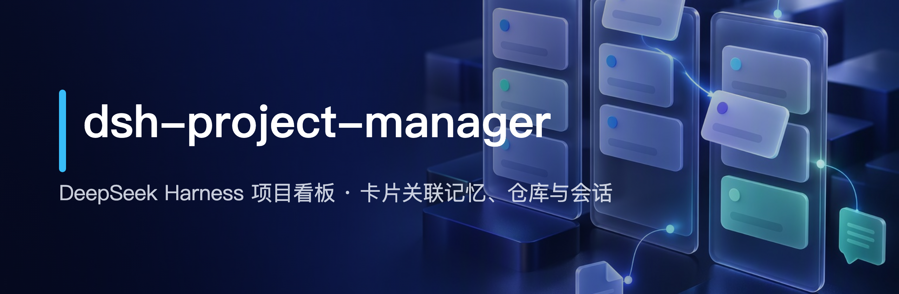
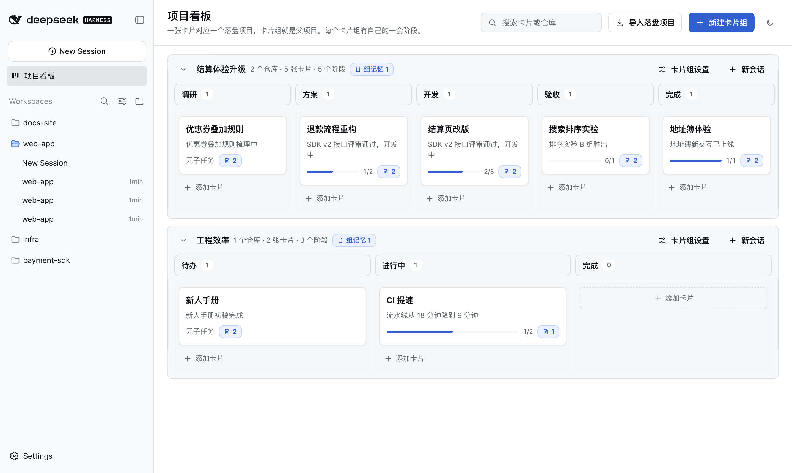
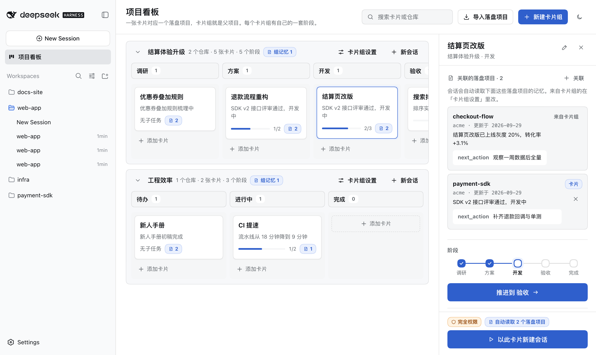
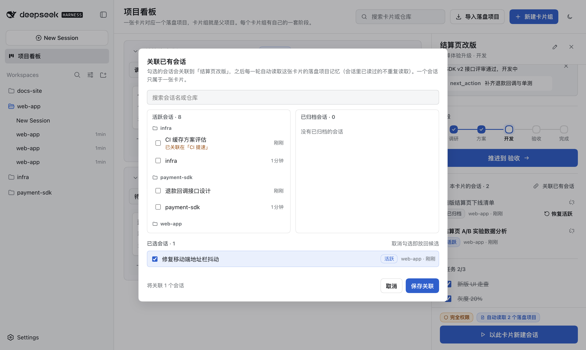
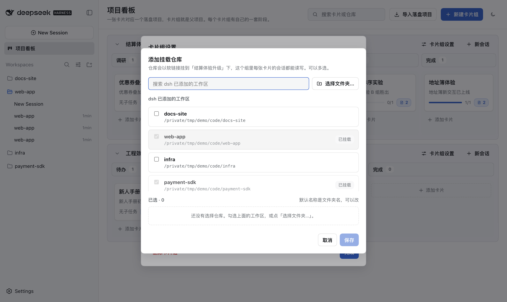
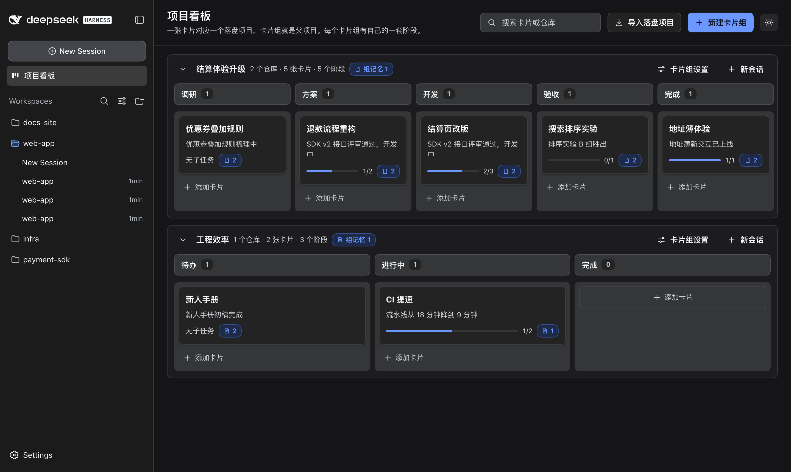

# dsh-project-manager



**给 DeepSeek Harness 加一块项目看板：卡片组管父项目，卡片管任务；每张卡片关联落盘项目记忆、挂载仓库、绑定会话，从卡片开的会话自动带上项目上下文。**

[**English**](README.en.md) · [Releases](https://github.com/hoyyang/dsh-project-manager/releases) · [更新日志](CHANGELOG.md)

<p align="center">
  <a href="https://www.npmjs.com/package/dsh-project-manager"></a>
  <a href="https://www.npmjs.com/package/dsh-project-manager"></a>
  <a href="https://github.com/hoyyang/dsh-project-manager/releases"></a>
  <a href="LICENSE"></a>
  <a href="https://github.com/hoyyang/dsh-project-manager/stargazers"></a>
</p>

## 安装

```sh
dsh plugin add dsh-project-manager
```

备选（直接从 GitHub 装）：

```sh
dsh plugin add github:hoyyang/dsh-project-manager
```

**零配置、开箱即用**：装完重启 dsh web 即可，不需要账号、API Key 或任何设置项。要求 DSH `0.1.5-rc.1`（实测通过，其他版本未验证）。落盘项目默认从 `~/.ai` 只读扫描；要改数据目录或权限模式见下文「配置」。

## 功能



- **按项目看全局**：每个卡片组一条泳道，阶段（列）名称、数量、顺序都能改；卡片在阶段内拖动排序（键盘 Alt+↑/↓），拖到别的阶段即推进。
- **每个阶段随手加卡**：阶段底部常驻「添加卡片」，回车连续添加，Esc 收起；也能从落盘项目批量导入。
- **卡片带着项目记忆走**：卡片组和卡片都能关联多个 /landfill-project 落盘项目（`STATE.md`），会话读取「卡片组 ∪ 卡片」去重后的记忆：一行状态、next_action、STATE 路径。
- **会话自动读记忆，读过的不重复**：从卡片新建或手动关联的会话，每一轮自动注入卡片记忆；关联时扫描会话记录，已经 `read` 过的 STATE 不再注入。
- **关联已有会话**：搜索会话名或仓库，活跃 / 已归档两列按仓库分组、新的在前，勾选进入「已选会话」后一次保存；一个会话只属于一张卡片。
- **已归档一键恢复**：已关联列表显示名字与状态，已归档的不能打开，点「恢复活跃」回到工作区原来的位置；「解除关联」二次确认，不删会话。
- **挂载仓库**：「添加挂载仓库」弹窗从 dsh 已添加的工作区勾选，或用 dsh 的系统选文件夹对话框；默认名称是文件夹名、可改、可多选。
- **项目区工作区**：插件在工作区列表置顶一个「项目区」，项目会话集中在这里；标题旁的看板按钮打开看板，「+」先选卡片再建会话。
- **agent 也能改看板**：4 个工具 `card_manage` / `repo_manage` / `phase_move` / `task_manage`，在项目会话里不传 card 就作用于本会话的卡片。

**和已有插件的差别**：dsh-project-kanban 等看板插件按工作区记待办；本插件不做通用待办，只做「项目 → 落盘记忆 → 仓库 → 会话」这条链：卡片即项目，会话自动继承项目上下文。

## 快速上手（30 秒）

1. 点击侧栏的「项目看板」（有「项目区」后改点它标题旁的看板按钮），再点击右上角「新建卡片组」，输入组名后按回车。
2. 点击任意阶段底部的「添加卡片」，输入标题后按回车；可以连续输入多张。
3. 打开卡片详情，点击「关联的落盘项目」旁的「关联」，勾选落盘项目后保存。
4. 打开「卡片组设置」，点击仓库旁的「添加」，勾选 dsh 已有的工作区或点击「选择文件夹…」，再点击「保存」。
5. 点击卡片详情底部的「以此卡片新建会话」：会话出现在「项目区」，标题是「卡片组 · 卡片」，已带上记忆。
6. 点击「本卡片的会话」旁的「关联已有会话」，勾选已有会话后点击「保存关联」。
7. 拖动卡片到下一个阶段，或点击详情里的「推进到 …」按钮推进进度。

| 操作 | 结果 |
|---|---|
| 拖动卡片到别的阶段 | 卡片移到新阶段，`events.jsonl` 追加一条 move 记录 |
| 在阶段底部输入标题并回车 | 该阶段末尾出现新卡片，输入框保留可继续添加 |
| 勾选会话并点击「保存关联」 | 会话出现在「本卡片的会话」，下一轮起自动读取卡片记忆 |
| 点击已归档会话的「恢复活跃」 | 会话回到工作区原来的位置，状态变成「活跃」 |
| 在「添加挂载仓库」里勾选工作区并保存 | 项目区目录出现 `repos/<卡片组>/<仓库>` 软链接，AGENTS.md 同步更新 |
| 挂载一个已挂载过的路径 | 保存被拒绝，提示 `REPO_MOUNTED` 并点名已挂载的仓库 |

在项目会话里让 agent 操作看板（不传 `card` 就作用于本会话的卡片）：

```text
> 把这张卡片推进到「验收」，再加一个子任务「补回归用例」
phase_move  { "status": "verify" }                     → {"ok":true,"event":{"kind":"move","from":"开发","to":"验收"}}
task_manage { "op": "add", "text": "补回归用例" }      → {"ok":true,"tasks":[…,{"text":"补回归用例","done":false}]}
```



## 使用场景

- **一个需求跨多个仓库**：卡片组挂上前端、SDK、基础设施几个仓库，项目会话里用 `repos/<组>/<仓库>/` 统一读写，AGENTS.md 自动列出仓库清单。
- **长周期项目接续**：/landfill-project 落盘的 STATE 关联到卡片，第二天从卡片开新会话，状态和 next_action 已经在上下文里，不用再「回忆」。
- **把零散会话收拢到项目**：之前在各个工作区开的讨论会话，用「关联已有会话」挂到同一张卡片下，项目进展一眼看全。
- **找回归档过的会话**：之前归档的讨论又要继续时，在卡片里一键「恢复活跃」，会话回到原工作区原位置继续用。
- **每天开工先看全局**：打开看板就能看到每个项目停在哪个阶段、子任务完成了多少、哪些卡片还没关联记忆。
- **交接给同事或新会话**：卡片上的落盘项目、挂载仓库和会话列表就是交接清单，新会话从卡片打开即可接手。
- **按阶段做评审**：卡片组的阶段可以按团队流程命名（如「方案 → 开发 → 验收」），评审时按列逐张过卡片。
- **让 agent 自己推进**：在项目会话里让 agent 调 `phase_move` 推进阶段、`task_manage` 勾子任务，看板实时更新，每次移动写审计日志。



## 运行效果

- 看板上每张卡片显示子任务进度条和「记忆 N」标记，没关联落盘项目的卡片标 0 提醒。
- 会话输入框上方出现记忆提示条：「已自动读取 N 个落盘项目的记忆，M 个已读过不重复读取」，展开看每项的 next_action。
- 「项目区」工作区里的会话默认完全访问权限，标题自动改为「卡片组 · 卡片」。
- 项目区目录生成 `repos/<卡片组>/<仓库>` 软链接和 `AGENTS.md`，仓库里的 AGENTS.md / CLAUDE.md 按字面路径加载。
- 每次移动、关联、挂载都追加到 `events.jsonl`，可追溯谁（用户 / agent）在什么时候做了什么。
- 深色主题跟随 dsh，看板右上角可一键切换。



## 配置

零配置即可使用。需要时在 profile 的 `cordis.patch.yml` 加顶层 id 条目覆盖：

```yaml
- id: dsh-project-manager
  config:
    dataDir: ''                              # 缺省 <DSH_HOME>/dsh-project-manager
    aiRoot: ''                               # 缺省 ~/.ai（只读）
    hubTitle: 项目区
    projectSessionMode: danger-full-access   # 或 inherit（跟随全局权限）
    memoryMaxBytes: 6000
```

## 工作原理

- **数据**：看板存在 `<dataDir>/board.json`（原子写 + 串行变更），审计追加到 `events.jsonl`；落盘项目按需只读扫描 `~/.ai/projects/*/memory/designs/*/STATE.md`。
- **项目区**：插件用官方 `workspaceRegistry` 登记一个工作区（目录 `<dataDir>/hub`）并保持置顶；仓库以软链接挂在 `hub/repos` 下。
- **记忆注入**：通过官方 `systemPrompt.context` 按会话注入卡片记忆；文本不变不重发，关联时算出的「已读」集合固定不变，避免反复注入。
- **会话与归档**：候选来自 dsh 的会话列表与工作区列表；恢复归档调用 `workspaceRegistry.unarchiveSession`（dsh-manage-sessions 提供），归档从不改变会话在工作区里的顺序，所以恢复即回原位。
- **界面**：看板是主区面板；侧栏「项目区」行的看板按钮与「+」接管是 DOM 增强，找不到该行时自动退回官方面板入口。

## 可靠性与验收

- **隔离验证**：每个版本先在独立的 staging DSH_HOME 装配，冷启动静态检测（依赖链接 / bundle 清单 / 重复 entry 等六类）全绿后才转正。
- **升级验证**：用上一版构建灌旧数据，原地升级后读取无损（例如 0.2.0 自动去掉旧的类别与证据门字段，阶段与卡片位置保留）。
- **卸载重装幂等**：卸载后无样式、无入口、路由 404、用户数据保留；重装后数据与关联完整恢复。
- **单元测试**：33 项 node:test 覆盖看板模型、批量挂载冲突、会话批量关联与移动、已读判定、记忆预算与省略提示、软链不越界。
- **真实 GUI 测试**：Playwright 在真实 dsh web 上跑完整交互（拖拽、就地添加、弹窗多选、恢复归档、解除确认、深浅色），0 报错。
- **失败会点名**：冲突与错误返回明确代码与对象，如 `REPO_NAME_TAKEN`、`REPO_MOUNTED`、`NOT_LINKED`、`UNARCHIVE_UNAVAILABLE`，不静默吞掉。
- **兼容与限制**：「恢复活跃」依赖 dsh-manage-sessions 的核心补丁，缺失时按钮置灰并说明原因；多个 dsh 进程共用同一 DSH_HOME 时没有跨进程锁。
- **安全边界**：项目会话默认完全访问（只对项目区目录的会话生效，可改 `inherit`）；HTTP 路由只接受本机回环、写操作校验同源，没有登录态校验；不读写凭据、不访问网络、不执行 git；删除卡片组只删软链接，不删真实仓库。



## 常见问题

- **侧栏没看到「项目区」？** 新建第一个项目会话后才会登记；在那之前用侧栏「项目看板」入口。
- **「恢复活跃」是灰的？** 当前 dsh 没有 `workspaceRegistry.unarchiveSession`，装 dsh-manage-sessions 并应用它的核心补丁即可。
- **「选择文件夹…」变成了输入框？** dsh 使用网页文件浏览器（非本机访问或远程）时打不开系统对话框，直接输入绝对路径。
- **新会话侧栏显示「New Session」？** dsh 对空白会话的显示规则；发出第一条消息后显示「卡片组 · 卡片」。

## 卸载

1. 调用 `POST /_dsh/dsh-project-manager/api/hub/cleanup`（或在工作区列表手动移除「项目区」），撤销插件登记的工作区条目；会话与文件不会被删除。
2. `dsh plugin --profile web remove dsh-project-manager`（并从 profile `package.json` 的 `dsh.profile.bundles` 删掉本插件），重启 `dsh web`。
3. 数据保留在 `<DSH_HOME>/dsh-project-manager/`（board.json、events.jsonl、hub/），需要时手动删除。

## 本地构建

```sh
npm install
npm run build          # host：tsc → lib/
npm run build:client   # client：tsdown → lib/client.js
npm run typecheck
npm test               # node:test 单测
```

## 许可证

[MIT](LICENSE)
